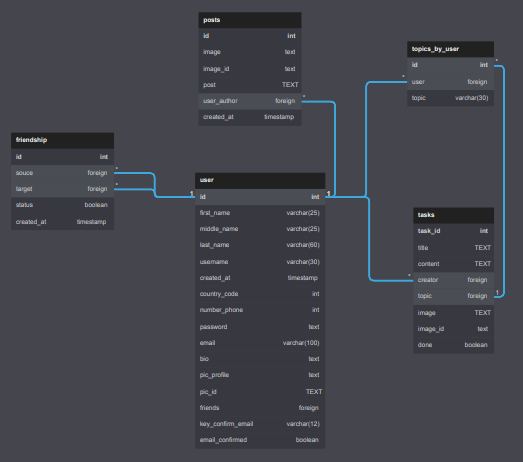

# Notes App Server

I designed the database on: https://dbdiagram.io/home



you can see in the db design pdf

# Getting Started

~~~~~`````````~`~
git clone https://github.com/Fredvel123/notes_app.git
cd backend/
yarn dev
``~~~````````````

# End Points REST Api


## Get All Users

METHOD: GET
~~~
https://www.example.com/api/users/all 
~~~

``` js
const getAllUsers = async () => {
    const url = 'https://www.example.com/api/users/all';
    const request = await fetch(url);
    const response = await request.json();
    return response;
}     
```

## Register User (Log In)

METHOD: POST
~~~
https://www.example.com/api/auth/login 
~~~

``` js
const registerUser = async () => {
    const url = 'https://www.example.com/api/auth/login';
    const request = await fetch(url, {
        method: "POST",
        headers: {
            "Content-type": "application/json"
        },
        body: JSON.stringify({
            email: "email@example.com", 
            password: "yourpassword" 
        })
    });
    const response = await request.json();
    return response;
}     
```
## Create New User (Sign Up)

METHOD: POST
~~~
https://www.example.com/api/auth/signup 
~~~

``` js
const createNewUser = async () => {
    const url = 'https://www.example.com/api/auth/signup';
    const request = await fetch(url, {
        method: "POST",
        headers: {
            "Content-type": "application/json"
        },
        body: JSON.stringify({
            username: "username", // greater than 5 and less than 30 characters
            email: "email@example.com", // no empty email
            password: "yourpassword" // greater than 5 and less than 25 characters
        })
    });
    const response = await request.json();
    return response;
}     
```
